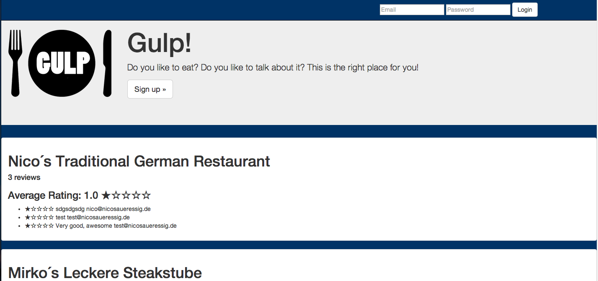

Yelp-Clone
===
We´re creating a YELP clone to get a basic introduction to Rails.


Objectives of exercise
----
Object orientation, folder structure, migrating the Databases correctly, test-driving everything.

What could be added
----
Diverse validations as well as more frontend design

Technologies used
----
- Ruby
- Ruby on Rails
- Capybara
- Rspec
- HTML
- Postgresql
- Mustache.js
- Phantom.js
- [Poltergeist]

How to run it
----
```sh
git clone git@github.com:NicoSa/Yelp-Clone.git
cd Yelp-Clone
bin/rails server
```
go to localhost:3000/restaurants

How to test it
----
```sh
cd Yelp-Clone
rspec
```

Pairing Partners
----
[Apo], [Dan]

[Dan]:https://github.com/DLDB
[Apo]:https://github.com/apostolistax
[Poltergeist]:https://github.com/teampoltergeist/poltergeist
